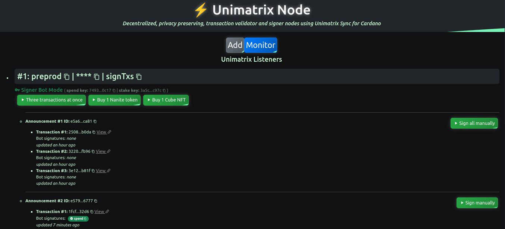
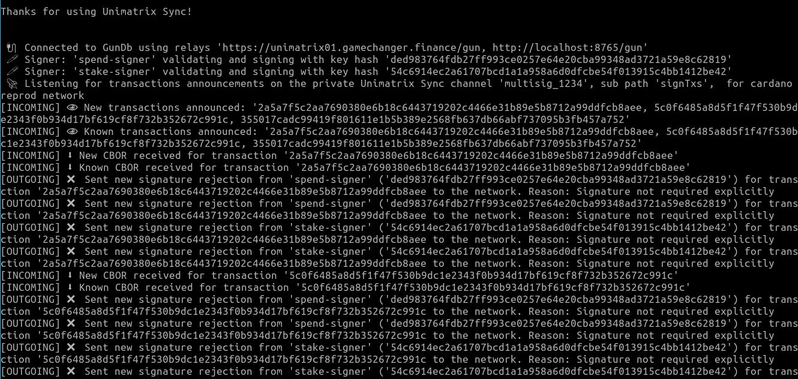

# Unimatrix Library

**Unimatrix Sync for Cardano** is a decentralized, privacy-preserving transaction witness sharing and pairing solution for multi-signatures or deferred signatures on **Cardano Blockchain** built over **Unimatrix**. 

>**Unimatrix** is a real-time protocol where clients reads and writes encrypted data over [GunDB](https://gun.eco/), a decentralized key-value store used as a shared cache storage. It creates channels using obfuscated (hashed) keys and encrypted data values, only allowing the bearers of certain channel parameters and right data to locate and decrypt the information.
Originally created for **GameChanger Wallet** and targeted but not limited to the **Cardano Blockchain**, it aims to improve multi-signature user experience on #RealFi scenarios and boost multisig dapps and services.

## Table of Contents

- [Installation](#installation)
  - [Library](#install-library)
  - [Dependencies](#install-dependencies)
- [Examples](#examples)
  - [React Dapp](#react-dapp)
  - [NodeJs Service](#nodejs-service)
- [Usage](#usage)
  - [Initialization](#initialization)
  - [Basic Example](#basic-example)
  - [Common Patterns](#common-patterns)
    - [Announcer Pattern](#announcer-pattern)
    - [Signer Pattern](#signer-pattern)
  - [Universal Dapp Connector](#universal-dapp-connector)
- [API](#api)
- [Testing](#testing)
- [Development](#development)
    - [Install](#install)
    - [Build](#build)
    - [Try it locally](#try-it-locally)
    - [Generate docs](#generate-docs)
- [Contributing](#contributing)
- [TODO](#todo)
- [License](#license)

## Installation
### Library
To install the library on your project:

```bash
npm install -s @gamechanger-finance/unimatrix
```
### Dependencies
To install the dependencies, use npm. Check [examples directory](/examples/) for more details on how you can import them.

```bash
npm install -s gun 
# on browser:
npm install -s @emurgo/cardano-serialization-lib-browser
# on nodeJs:
npm install -s @emurgo/cardano-serialization-lib-nodejs

```

## Examples

Check the [examples section](examples/README.md) to learn how you can create **Unimatrix Sync** instances on frontend and backend to build multi-signature dapps and services.

- [React Example](examples/react): 4 use cases in 1 dapp ([Live Demo](https://unimatrix-node.netlify.app/))
- [NodeJS Example](examples/nodejs): signing bot service

### React Dapp



The [React Example](examples/react) is a complete client side dapp (more specifically, a signing bot) [using the Universal Dapp Connector](examples/react/src/app/services/gcscripts.ts#L127), that builds and signs multi-signature transactions on user wallets. There you have 4 use cases in one dapp.

### NodeJs Service


The [NodeJS Example](examples/nodejs) is a simple signing bot service that validates and shares transaction key witnesses (signatures) for any announced transaction on a channel.

## Usage

### Initialization

First, import library and dependencies. Then initialize the connection in your project:

```typescript
// Import Unimatrix Sync for Cardano
import {cardano as CardanoSync} from '@gamechanger-finance/unimatrix'

// Import dependencies:
import Gun from 'gun';

import * as CSLib from '@emurgo/cardano-serialization-lib-browser';// on browser
// or
import * as CSLib from '@emurgo/cardano-serialization-lib-nodejs'; // on nodeJs


// Initialize GunDB connection pointing to the same relay peers on all your signing/listening nodes
// For example:
const connection=new Gun({peers:[
    "http://localhost:8765/gun", // your local GunDB relay peer instance. Remember to share your peers on dapp connection to allow user wallets to connect with your nodes
    "https://unimatrix01.gamechanger.finance/gun" // shared peer for GameChanger Wallets (wallet can act as signing/listening/broadcasting nodes)
    //add your peers...
]});

// That's it. You are ready to use the library now.

```

### Basic Example

Here's a basic example, let's listen for live broadcasted transaction hashes on specific channel.

```typescript

CardanoSync.onTxHashes({
    //dependencies:
    CSL:CSLib,
    db: connection,
    // channel parameters:
    id: "multisig_1234",
    dltTag: "cardano",
    networkTag: "mainnet",
    subPath: "signTxs",
    // callback that gets fired on each broadcasted transaction group:
    cb:async ({txHashes,stop})=>{
        for (const txHash of txHashes) {
            console.log(`Received announcement for transaction ${txHash}`)
        }
    }),
});

```


### Common Patterns

Usually there are 2 basic patterns that can be implemented with the library for multi-signature scenarios. You are free to implement your own variations to fit your requirements.

The following examples work in tandem, both are different Unimatrix instances separated by time and space. In other terms, a typical multi-signature scenario running asynchronous Javascript/Typescript code on 2 sides, a signer and a signature-requirer node.

Keep in mind that transaction hash announcements and listeners are optional steps that improves UX, but are not strictly required if you can exchange hashes by your own means.

#### Announcer Pattern
A node that shares on a channel a transaction to get signed by a signer node and awaits for the incoming signature.

1. announces the transaction hash
2. shares the specific unsigned/half-signed transaction
3. awaits and downloads the specific signatures

```typescript
// common channel between the 2 instances
const params={
    //dependencies:
    CSL:CSLib,
    db: connection,
    // channel parameters:
    id: "multisig_1234",
    dltTag: "cardano",
    networkTag: "mainnet",
    subPath: "signTxs",
};

// a transaction is built and lacks some/all of it's signatures or key witnesses
// obtained txHex is transaction CBOR structure in hexadecimal encoding
// txHash is the hash of the transaction
// vkHash is the hash of the user key that needs to sign the transaction
const {txHash,txHex,vkHash}=theoreticalTxBuilder();

// the hash of the transaction is announced on the channel
await CardanoSync.setTxHashes({...params,txHashes:[txHash]});
//the txHex CBOR is uploaded on the channel for other nodes to sign it
await CardanoSync.setTxHex({...params,txHex});
//awaits for the incoming signature or key witness of the key hash `vkHash`
const {vkWitnessHex}=await CardanoSync.getVkWitnessHex({...params,txHash,vkHash});

console.log(`Signature received: ${vkWitnessHex}`);

```

#### Signer Pattern
A node that awaits for transaction announcements on a channel, signs and share back the signatures on the same channel.

1. awaits for transaction announcements
2. downloads the specific transaction 
3. signs the transaction
3. upload the specific signature

```typescript
// common channel between the 2 instances
const params={
    //dependencies:
    CSL:CSLib,
    db: connection,
    // channel parameters:
    id: "multisig_1234",
    dltTag: "cardano",
    networkTag: "mainnet",
    subPath: "signTxs",
};

// awaits for announced transactions on the channel
CardanoSync.onTxHashes({
    ...params,
    // callback that gets fired on each announced transaction group:
    cb:async ({txHashes,stop})=>{
        for (const txHash of txHashes) {
            console.log(`Received announcement for transaction ${txHash}`);
            // getter that downloads the transaction CBOR in hexadecimal encoding
            const {txHex}=await CardanoSync.getTxHex({...params,txHash});

            //node evaluates signing the transaction and signs using the key with hash `vkHash`, producing `vkWitnessHex`, a transaction key witness in hexadecimal encoding
            const {vkHash,vkWitnessHex}=theoreticalTxSign(txHex);

            // setter that uploads the transaction witness
            await CardanoSync.setVkWitnessHex({...params,txHash,txHex,vkHash,vkWitnessHex});
            console.log(`Signature shared: ${vkWitnessHex}`);
        }
    }),
});

```

For more examples, visit the [examples directory](examples/).


### Universal Dapp Connector

When working with the **Universal Dapp Connector for Cardano**, the **Unimatrix Sync Plugin** in `signTxs` API  creates a client-side *Unimatrix node* that works in user's wallets under both modes, following the *Announcer and Signer Patterns* at the same time on each call. Currently, only difference is that it does not awaits for incoming *transaction hash announcements*, as hashes are obtained through dapp connection itself, without *Unimatrix Sync*.

Each dapp connection can connect the user wallet `signTxs` API call with custom GunDB relay peers for even more privacy instead of using wallet's default peers. Ideally for dapps, DAOs and services like minter services.

Also some write events like transaction-hash announcements and transaction-key-witness sharing can be disabled on dapp connection calls for special or even more-private use cases.

The `signTxs` API **Roundtable Plugin** combined with the **Unimatrix Sync Plugin** seamlessly turns user wallets into decentralized multi-signature bridges for pairing signatures between the **GameChanger Wallet** and **Roundtable Wallet** "networks", and also with any other transaction signing solution on dapp side implemented with the Universal Dapp Connector.

This overall design is not trivial as was made time ago for **GameChanger Wallet** to be ready for professional #RealFi applications, where even static dapp connections based on QR codes can be deployed to solve complex multi-signature scenarios without the need of any external dapps or backends at all.

The next *gcscript* code snippet shows some of the *Unimatrix Sync* and *Roundtable* plugins parameters you can customize when launching multi-signature capable dapp connections, among with the usual local single-user signing plugins. This API call seamlessly turns user wallets into decentralized *GameChanger-Roundtable Wallet* bridges. Also, this call is requiring a user to sign 3 multi-signature transactions at once showing the powerful kind of use cases you can build.

```json

{
    "sign": {
        "type": "signTxs",
        "namePattern": "Multisig Transaction #{key}",
        "detailedPermissions": false,
        // Your custom multisig strategy. Check API docs for even more available plugins
        "multisig": [
            // Plugin for signing locally with user's Main Address
            {
                "kind": "MainAddress"
            },
            // Plugin for signing locally with keys derived on current Workspace
            {
                "kind": "CurrentWorkspace"
            },
            // Plugin for signing remotely with Roundtable Wallets
            {
                "kind": "Roundtable",
                "share": true,
                "relays":["https://myRoundtablePrivateRelay.com/gun"]
            },
            // Plugin for signing remotely with Unimatrix Sync: Remote dapps, services and user wallets can sign
            {
                "kind": "Unimatrix",
                "share": true,
                "shareTxs": true,
                "announceTxHashes": true,
                "id": "my_channel_secret_id",
                "announceTxHashesSubPath":"v1.3.12/transactions/2024/mints/signer05/worker18",
                "relays":["https://myUnimatrixPrivateRelay.com/gun"]
            }
        ],
        // List of transaction CBOR to sign with the specified strategy,
        // In this case we are asking a user wallet to sign 3 multisig transactions at once
        "txs": [
            "84a6008182...2cdc",
            "84a6008182...0a0a",
            "84a6008182...210a"
        ]
    }
}

```

For learning how to build dapps and backends using the **Universal Dapp Connector**, visit it's [General Documentation](https://github.com/GameChangerFinance/gamechanger.wallet/tree/main/docs). You can learn more about it's **SignTxs API** [here](https://beta-wallet.gamechanger.finance/doc/api/v2/signTxs.html).

Check the examples, specially the [React Example](examples/react) for a complete client side dapp (more specifically, a signing bot) [using the Universal Dapp Connector](examples/react/src/app/services/gcscripts.ts#L127).

## API

The Unimatrix library provides several functions to interact with.

Check the full list on the [API documentation](docs/README.md) pages.

## Testing
To run the tests, use the following commands:

```bash
npm test
```

For test coverage:

```bash
npm run test:cov
```


You can find the tests in the [test directory](test/).


## Development

### Install

Install with npm:

```bash
npm i
```

### Build

Build production (distribution) files in your **dist** folder:

```bash
npm run build
```

### Try it locally

Run:

```bash
npm link
```

[npm link](https://docs.npmjs.com/cli/v6/commands/npm-link) will create a symlink in the global folder, which may be **{prefix}/lib/node_modules/@gamechanger-finance/unimatrix** or **C:\Users\<username>\AppData\Roaming\npm\node_modules\@gamechanger-finance/unimatrix**.

Create an empty folder elsewhere, you don't even need to `npm init` (to generate **package.json**). Open the folder with VS Code, open a terminal and just run:

```bash
npm link @gamechanger-finance/unimatrix
```

This will create a symbolic link from globally-installed @gamechanger-finance/unimatrix to **node_modules/** of the current folder.

You can then create a, for example, **example.ts** file with the content:

```ts

import { ... } from '@gamechanger-finance/unimatrix'
...

```

If you don't see any linting errors in VS Code, if you can use library functions in your code, then it's all good.

Whenever you want to uninstall the globally-installed @gamechanger-finance/unimatrix and remove the symlink in the global folder, run:

```bash
npm uninstall @gamechanger-finance/unimatrix -g
```

### Generate docs

For generating/updating markdown Typescript API docs with *typedoc*:

```bash
npm run docs
```

## Contributing

Contributions are welcome! Please fork the repository and submit a pull request.

1. Fork the repository
2. Create a new branch (`git checkout -b "feat/flux-capacitor"`)
3. Make your changes
4. Include *jest tests* for your changes
5. Commit your changes (`git commit -m 'feat: flux capacitor added. MrFusion updated.'`)
6. Push to the branch (`git push origin "feat/flux-capacitor"`)
7. Open a pull request


## TODO

- A minor breaking change regarding public metadata with it's co-related wallet-side update is pending.

## License

This closed-source project has been improved and released as open source after ₳91.1M positive votes from the Cardano community on Fund 11 of Project Catalyst. Thanks voters and Catalyst for making this possible and help builders to keep working on open source tooling for the great Cardano ecosystem.

See the LICENSE file for details.

