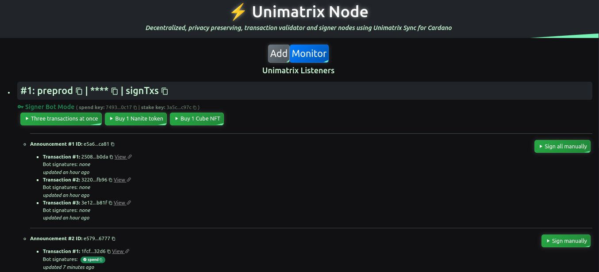
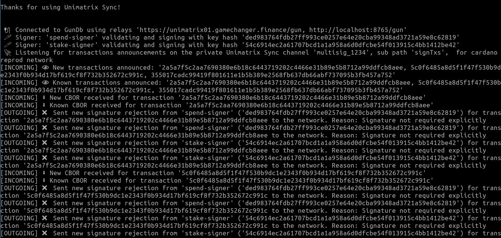

# Unimatrix Library

## Examples

Check these examples to learn how to create **Unimatrix Sync** instances on frontend and backend to build multi-signature dapps and services.

- [React Example](react/): 4 use cases in 1 dapp ([Live Demo](https://unimatrix-node.netlify.app/))
- [NodeJS Example](nodejs/): signing bot service

### React Dapp:

The [React Example](react/) is a complete client side dapp (more specifically, a signing bot) [using the Universal Dapp Connector for Cardano](react/src/app/services/gcscripts.ts#L127), that builds and signs multi-signature transactions on user wallets. There you have 4 use cases in one dapp:

- **3 transactions in 1 dapp connection call**: Be sure to have more than 3 UTXOs available as you will be using *GameChanger Wallet's* well known multi-transaction multisig features, otherwise you will face a *missing balance screen*.
- **Token sale**: a decentralized, backend-less, token sale with instant, in-user-wallet multisig minting
- **NFT sale**: a decentralized, backend-less, NTF sale with instant, in-user-wallet multisig minting
- **Passive mode**: monitor announced transactions live, letting users manually sign and share their transactions by connecting their wallets. Handy for DAOs and user groups, or single users with semi-cold wallet setups.  

#### Signer Bot Mode Instructions:

1. create or import a Cardano wallet on [GameChanger Wallet for Mainnet](https://beta-wallet.gamechanger.finance/) or [GameChanger Wallet for Pre-Production Testnet](https://beta-preprod-wallet.gamechanger.finance/)
2. get enough balance and UTXOs:
    - On **empty Pre-Production Testnet wallets** a free airdrop button will appear after some seconds. Click on it and follow the steps. With this method you will get enough balance and UTXOs to get started, no other step needed.
    - Otherwise ensure you have enough balance and UTXOs on your wallet. You can make any transaction like sending 1 ADA to yourself on **Smart Send** to let the wallet generate several change outputs producing enough UTXOs to try the examples
3. go to the **live version** of the dapp
4. import or generate a random seed phrase, different from the seed phrase used on **GameChanger Wallet** as this one is for generating signing bot private keys. **Important:** You don't need any balance on this other wallet, bot will only use the derived keys to remotely sign transactions.
5. select your *Cardano Network* and customize your channel with a random unique ID
6. click on the button to add this listener
7. on *Listeners Tab* click on any of the 3 green use case buttons to try **Unimatrix Sync** in action. Each of these will launch a dapp connection with your wallet, follow the steps and after your user signature is applied, bot signatures will be received instantly and smoothly, no extra actions needed, only follow the dapp connection wizard.
8. Enjoy!

### NodeJs Service:

The [NodeJS Example](nodejs/) is a simple signing bot service that validates and shares transaction key witnesses (signatures) for any announced transaction on a channel. Is similar to the [React Example](react/) but without UI and dapp connections to any user wallet, intended as a boilerplate for multi-signature services such as an NFT minter for example.

This service can receive parameters through these environment variables:
- DLT
- NETWORK
- MNEMONIC
- SPEND
- STAKE
- FEE
- ADDRESS
- UNIMATRIX_ID
- UNIMATRIX_TX_PATH
- UNIMATRIX_PEERS

Check [nodejs/src/config.js](nodejs/src/config.js) for their default values to get you started. 